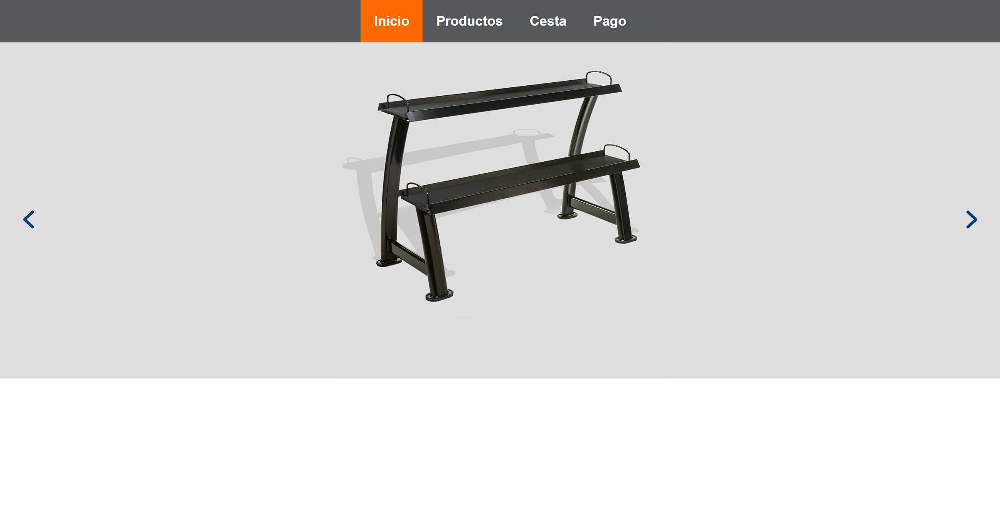
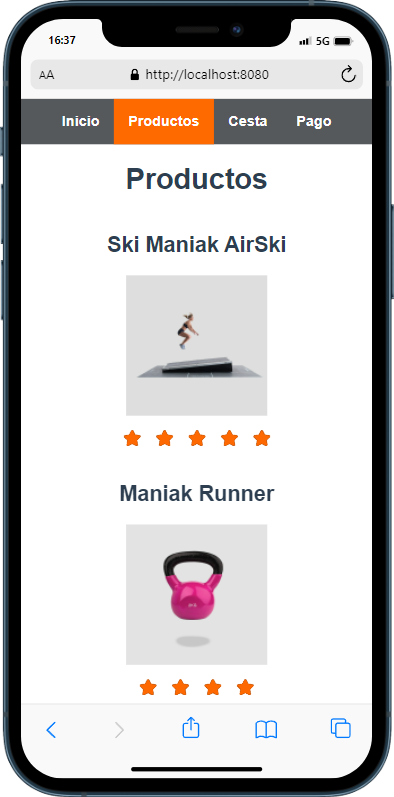
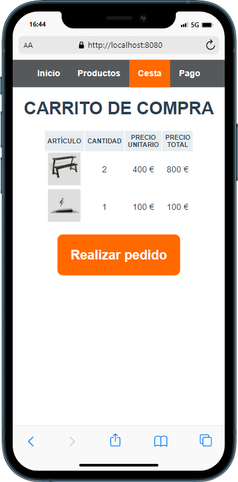

# Ponte Fuerte

App ecommerce de productos deportivos.

## Tabla de contenidos
- [Vista general](#vista-general)
  - [Enlace a la web](#enlace-a-la-web)
  - [Capturas en ordenador](#capturas-en-ordenador)
  - [Capturas en móvil](#capturas-en-móvil)
- [Desarrollo](#desarrollo)
  - [Tecnologías](#tecnologías)
  - [Reproducir en local](#reproducir-en-local)
- [Autor](#autor)
## Vista General
### Enlace a la web
Descubre la app Ponte Fuerte en:
https://pontefuerte.netlify.app/

### Capturas en ordenador


### Capturas en móvil



## Desarrollo
### Tecnologías
- Maquetación: HTML5
- Estilos: CSS
- Funcionalidad: VueJS, Vue Router, VueX
- Empaquetador: webpack
- Librerias: axios, sweetAlert

### Reproducir en local
Clona el proyecto
```
  git clone https://github.com/geminway92/cultura-y-ocio-malaga.git
```
Entra en la carpeta
```
  cd taperia-larondenia
```
Instala las dependencias del proyecto
```
  npm install
```
Construye el proyecto
```
  npm run build
```
Inicia el proyecto en local
```
  npm run serve
```

## Autor
- [Gema Martín](https://github.com/geminway92)
